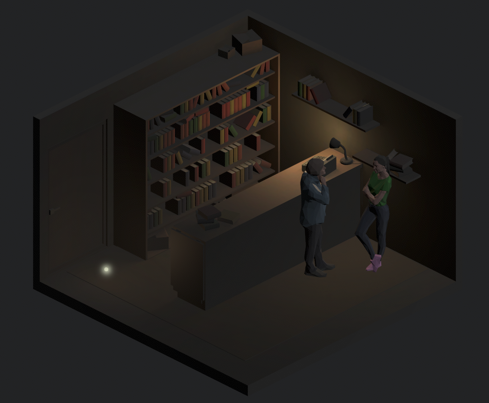
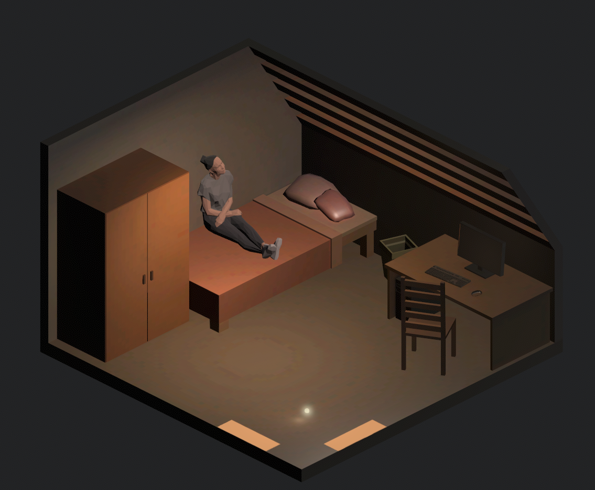
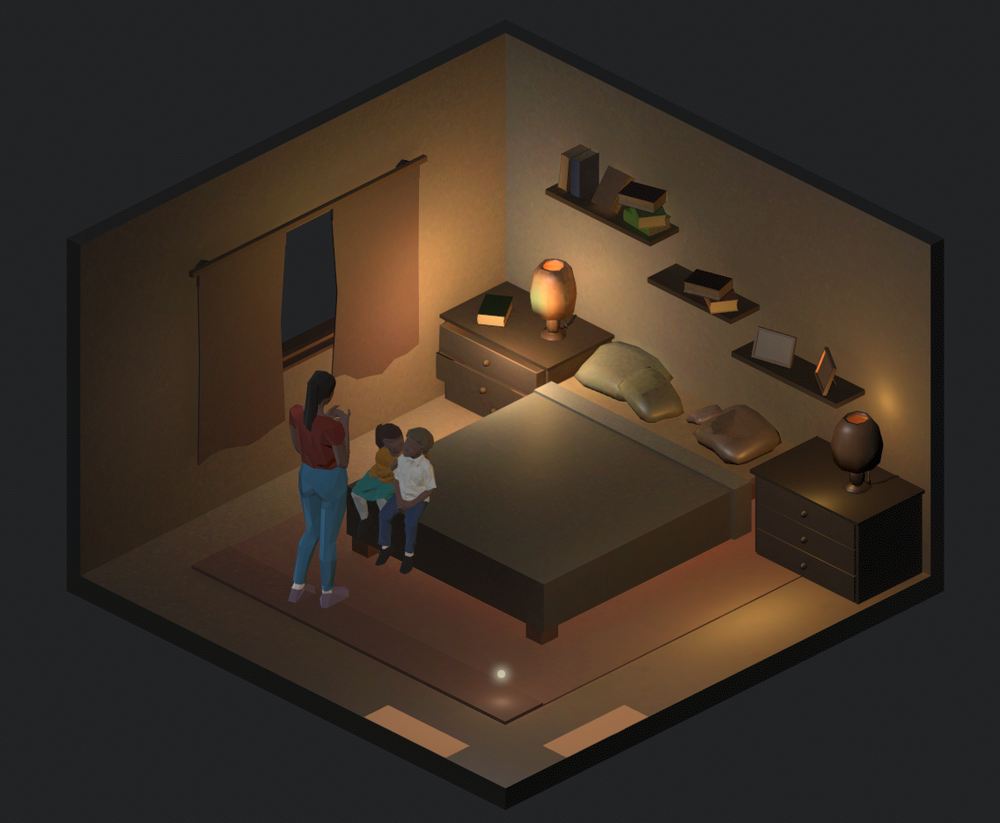
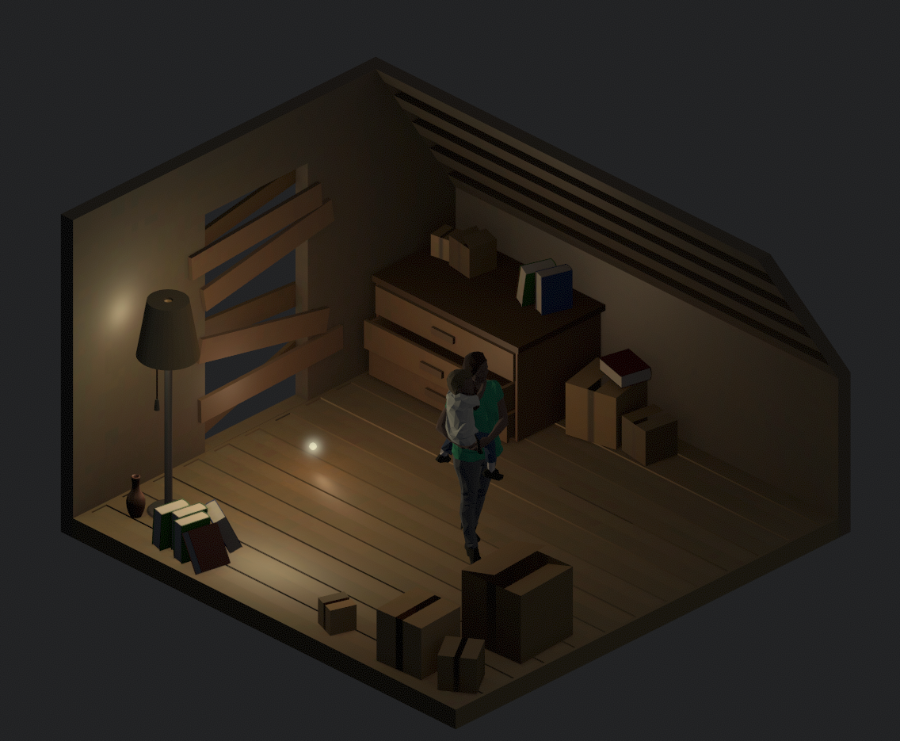

# Requiem

Requiem is an exploration of memory. It was my final project for an art practice class on digital art in which my theme
was *finding home away from home*. In this game you play a pulsating light sphere and navigate a home to revive old memories.

